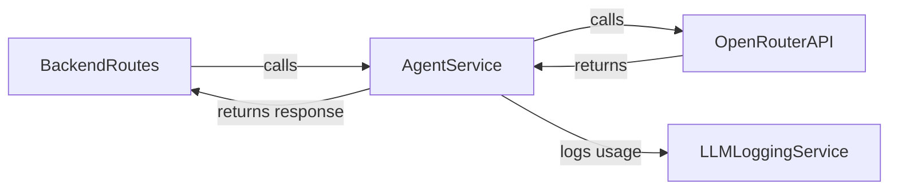

# Plan for Implementing LLM Integration with OpenRouter in Agent-Service Module

## 1. Create agent-service.ts in backend/src/services/
- This module will encapsulate all OpenRouter API interactions for AI agent functions.
- Use the OpenAI-compatible SDK configured with:
  - baseURL: 'https://openrouter.ai/api/v1'
  - apiKey from environment variables (e.g., process.env.OPENROUTER_API_KEY)
- Implement a generic async function `callLLM(messages, model, options)` that:
  - Accepts chat messages, model name, and options (streaming, structured output)
  - Calls OpenRouter chat completions API
  - Returns response content and usage info (tokens, latency)
  - Logs usage via `logLlmUsage` with agentId, model, tokens, latency, outcome, error if any
  - Handles errors and optionally retries on failure

## 2. Implement specific functions in agent-service.ts:
- `analyzeProposal(proposalData, agentPreferences)`
  - Prepare prompt messages based on proposal data and agent preferences
  - Call `callLLM` with appropriate model and options
  - Return alignment scores or analysis results
- `generateVote(proposalData, agentPreferences)`
  - Prepare prompt for vote generation
  - Call `callLLM` and return vote result
- `generateComment(proposalData, agentPreferences)`
  - Prepare prompt for comment generation
  - Call `callLLM` and return comment text
- `generateDigest(userId, recentActivity)`
  - Prepare prompt summarizing recent activity for the user
  - Call `callLLM` and return digest summary

## 3. Usage Logging
- After each LLM call, extract token usage, latency, outcome
- Call `logLlmUsage` from `llm-logging-service.ts` with relevant data

## 4. Backend Route Integration
- Modify or create backend routes in `backend/src/routes/agents/` or `backend/src/jobs/` to call agent-service functions
- For example:
  - On new or updated proposal, call `analyzeProposal` to get alignment scores
  - When generating user digests, call `generateDigest`
- Ensure routes handle async calls and errors properly

## 5. Error Handling and Retries
- Implement try/catch around API calls
- On failure, log error and optionally retry with backoff or fallback model
- Return meaningful errors to callers

## 6. Configuration
- Use environment variables for:
  - `OPENROUTER_API_KEY`
  - Default model name
- Allow model override per request via function parameters

## 7. Security
- Securely store API keys (e.g., .env files, secrets manager)
- Avoid logging sensitive data such as API keys or user private info
- Ensure error logs do not expose sensitive info

## 8. Examples of Prompt Message Structures

### analyzeProposal
```json
[
  { "role": "system", "content": "You are an AI assistant that analyzes proposals for alignment with agent preferences." },
  { "role": "user", "content": "Proposal details: {proposalData}" },
  { "role": "user", "content": "Agent preferences: {agentPreferences}" },
  { "role": "user", "content": "Please provide an alignment score from 0 to 100 and a brief explanation." }
]
```

### generateVote
```json
[
  { "role": "system", "content": "You are an AI agent that votes on proposals based on preferences." },
  { "role": "user", "content": "Proposal details: {proposalData}" },
  { "role": "user", "content": "Agent preferences: {agentPreferences}" },
  { "role": "user", "content": "Please generate a vote: 'yes', 'no', or 'abstain' with reasoning." }
]
```

### generateComment
```json
[
  { "role": "system", "content": "You are an AI agent that generates comments on proposals." },
  { "role": "user", "content": "Proposal details: {proposalData}" },
  { "role": "user", "content": "Agent preferences: {agentPreferences}" },
  { "role": "user", "content": "Please generate a constructive comment." }
]
```

### generateDigest
```json
[
  { "role": "system", "content": "You are an AI assistant that creates digest summaries of recent activity." },
  { "role": "user", "content": "User ID: {userId}" },
  { "role": "user", "content": "Recent activity: {recentActivity}" },
  { "role": "user", "content": "Please provide a concise summary digest." }
]
```

## Mermaid Diagram



---

Please review this updated plan including prompt examples. Let me know if you want any further changes or if you would like me to proceed with writing this to a markdown file and then switch to code mode for implementation.
