# Dashboard Redesign Implementation Status and Completion Plan

## Current Status Overview

After examining the codebase, I've identified the following status of the dashboard implementation:

1. **Basic Dashboard Structure**: The tabbed interface is implemented in `DashboardPage.tsx` with three tabs (Positions Matrix, Activity Audit, Proposals).

2. **Tab Components**: All three tab components exist (`PositionsMatrixTab`, `ActivityAuditTab`, `ProposalsTab`).

3. **Persistent Chat Panel**: The `AgentChatPanel` is implemented but lacks proper context-awareness for different tabs.

4. **Major Issues Identified**:
   - User personalization uses agent name instead of actual user name
   - Issues matrix uses hardcoded data instead of fetching from onboarding/API
   - Non-functional "Discuss new issue" buttons (only log to console)
   - Non-functional proposal creation flow
   - Missing cross-tab navigation and context sharing

## Implementation Plan

```mermaid
graph TD
    A[Dashboard Completion Plan] --> B[1. Fix Core Infrastructure]
    A --> C[2. Complete Tab Components]
    A --> D[3. Enhance Chat Integration]
    A --> E[4. Real-time Data Integration]
    A --> F[5. Testing and Refinement]
    
    B --> B1[Fix personalization]
    B --> B2[Implement proper context sharing]
    B --> B3[Add API endpoints for dynamic data]
    
    C --> C1[Complete Positions Matrix functionality]
    C --> C2[Complete Activity Audit functionality]
    C --> C3[Complete Proposals tab functionality]
    
    D --> D1[Enhance chat context awareness]
    D --> D2[Implement issue discussion triggers]
    D --> D3[Add proposal collaboration flow]
    
    E --> E1[Implement WebSocket connection]
    E --> E2[Create real-time updates for matrix]
    E --> E3[Add live notifications for activities]
    
    F --> F1[Test cross-tab navigation]
    F --> F2[Test chat context preservation]
    F --> F3[Test mobile responsiveness]
```



### 1. Core Infrastructure Fixes

#### 1.1. Fix User Personalization

The welcome messages currently use agent name instead of user's name. We need to:

```typescript
// In DashboardPage.tsx fetchData method:
const fetchData = async () => {
  setIsLoading(true);
  setError(null);
  try {
    // 1. Fetch user data first
    const userResponse = await fetch('/api/users/me', {
      headers: {
        'Authorization': `Bearer ${localStorage.getItem('token')}`
      }
    });
    
    if (!userResponse.ok) throw new Error('Failed to fetch user data');
    const userData = await userResponse.json();
    
    // 2. Then fetch agent data
    const agentResponse = await fetch('/api/agents/me', {
      headers: {
        'Authorization': `Bearer ${localStorage.getItem('token')}`
      }
    });
    
    if (!agentResponse.ok) throw new Error('Failed to fetch agent data');
    const agentData = await agentResponse.json();
    
    // 3. Set agent data with user name for personalization
    setAgentData({
      id: agentData.id,
      name: userData.name || userData.email.split('@')[0], // Use user name instead of agent name
      color: agentData.color,
      alignmentScore: agentData.alignmentScore,
      pausedUntil: agentData.pausedUntil
    });
    
    // Continue with other data fetching...
  } catch (err) {
    setError(err.message || 'Failed to load dashboard data.');
  } finally {
    setIsLoading(false);
  }
};
```

#### 1.2. Implement Cross-Tab Context Sharing

```typescript
// Create a shared context provider in a new file: frontend/src/context/DashboardContext.tsx

import React, { createContext, useState, useContext, ReactNode } from 'react';

interface DashboardContextType {
  currentTab: string;
  currentTabData: any;
  setCurrentTab: (tab: string) => void;
  setCurrentTabData: (data: any) => void;
  refreshData: () => void;
}

const DashboardContext = createContext<DashboardContextType | undefined>(undefined);

export const DashboardProvider: React.FC<{children: ReactNode}> = ({ children }) => {
  const [currentTab, setCurrentTab] = useState('positions');
  const [currentTabData, setCurrentTabData] = useState<any>(null);
  
  const refreshData = async () => {
    // Implement shared refresh logic
  };
  
  return (
    <DashboardContext.Provider value={{
      currentTab,
      currentTabData,
      setCurrentTab,
      setCurrentTabData,
      refreshData
    }}>
      {children}
    </DashboardContext.Provider>
  );
};

export const useDashboard = () => {
  const context = useContext(DashboardContext);
  if (context === undefined) {
    throw new Error('useDashboard must be used within a DashboardProvider');
  }
  return context;
};
```

#### 1.3. Add Missing API Endpoints

Create backend API endpoints for dashboard data:

- `GET /api/issues/user` - Fetch issues with user's positions
- `GET /api/activity/feed` - Fetch activity feed with pagination
- `POST /api/issues/:id/discuss` - Prepare chat context for discussing an issue

### 2. Tab Components Implementation

#### 2.1. Complete Positions Matrix Tab

1. **Connect to Real Data**:

```typescript
// In PositionsMatrixTab.tsx
const PositionsMatrixTab: React.FC<PositionsMatrixTabProps> = ({
  welcomeMessage,
  agentColor
}) => {
  const [issues, setIssues] = useState<Issue[]>([]);
  const [isLoading, setIsLoading] = useState(true);
  
  // Fetch issues from API instead of using props
  useEffect(() => {
    const fetchIssues = async () => {
      try {
        const response = await fetch('/api/issues/user', {
          headers: {
            'Authorization': `Bearer ${localStorage.getItem('token')}`
          }
        });
        
        if (response.ok) {
          const data = await response.json();
          setIssues(data);
        }
      } catch (error) {
        console.error('Error fetching issues:', error);
      } finally {
        setIsLoading(false);
      }
    };
    
    fetchIssues();
  }, []);
  
  // Rest of component...
}
```

2. **Implement Issue Discussion Functionality**:

```typescript
// In PositionsMatrixTab.tsx
import { useChatContext } from '../../hooks/useChatContext';

const PositionsMatrixTab: React.FC<PositionsMatrixTabProps> = ({
  // ...
}) => {
  const { setChatContext } = useChatContext();
  const onChatMaximize = useCallback(() => {
    // Function to maximize chat panel passed from parent
  }, []);
  
  const handleDiscussIssue = async (issueId: string) => {
    try {
      // Call API to prepare chat context
      const response = await fetch(`/api/issues/${issueId}/discuss`, {
        method: 'POST',
        headers: {
          'Authorization': `Bearer ${localStorage.getItem('token')}`
        }
      });
      
      if (response.ok) {
        // Set chat context for the issue
        setChatContext({
          type: 'issue_discussion',
          data: {
            issueId,
            title: issues.find(issue => issue.id === issueId)?.title
          }
        });
        
        // Maximize chat panel
        onChatMaximize();
      }
    } catch (error) {
      console.error('Error initiating issue discussion:', error);
    }
  };
  
  // Add this handler for "Discuss a New Issue" button
  const handleDiscussNewIssue = () => {
    setChatContext({
      type: 'new_issue',
      data: {}
    });
    onChatMaximize();
  };
  
  return (
    <div>
      {/* Component JSX with proper handlers attached to buttons */}
      <button 
        className="action-button"
        onClick={handleDiscussNewIssue}
      >
        Discuss a New Issue
      </button>
    </div>
  );
};
```

#### 2.2. Complete Activity Audit Tab

1. **Implement Virtual Scrolling**:

```typescript
// In ActivityAuditTab.tsx, add react-window for virtualization
import { FixedSizeList as List } from 'react-window';

// Inside component:
const ActivityList = ({ activities, onRespond, onViewContext }) => {
  // Calculate row height based on activity type
  const getItemSize = index => {
    const activity = activities[index];
    return activity.type === 'comment' ? 120 : 80; // Example sizes
  };
  
  const Row = ({ index, style }) => {
    const activity = activities[index];
    return (
      <div style={style} className="activity-item">
        {/* Activity item content */}
        <button onClick={() => onRespond(activity.id)}>Respond</button>
        <button onClick={() => onViewContext(activity.id, activity.type)}>View Context</button>
      </div>
    );
  };
  
  return (
    <List
      height={600}
      itemCount={activities.length}
      itemSize={getItemSize}
      width="100%"
    >
      {Row}
    </List>
  );
};
```

2. **Add Context Navigation**:

```typescript
// In ActivityAuditTab.tsx
const ActivityAuditTab: React.FC<ActivityAuditTabProps> = ({
  // ...props
}) => {
  const navigate = useNavigate();
  const { setChatContext } = useChatContext();
  
  const handleRespond = (activityId: string) => {
    // Set chat context for response
    setChatContext({
      type: 'activity_response',
      data: { activityId }
    });
    
    // Maximize chat
    onChatMaximize();
  };
  
  const handleViewContext = (activityId: string, activityType: string, contextId: string) => {
    // Navigate to the relevant tab/content
    switch (activityType) {
      case 'vote':
      case 'comment':
        navigate(`/proposals/${contextId}`);
        break;
      case 'position_update':
        setActiveTab('positions');
        // Highlight the specific issue
        break;
      // Other types...
    }
  };
  
  // Rest of component...
};
```

#### 2.3. Complete Proposals Tab

1. **Implement Collaborative Creation Flow**:

```typescript
// In ProposalsTab.tsx
const ProposalsTab: React.FC<ProposalsTabProps> = ({
  // ...props
}) => {
  // Add state for proposal creation
  const [isCreating, setIsCreating] = useState(false);
  const [currentProposal, setCurrentProposal] = useState<any>(null);
  const { setChatContext } = useChatContext();
  
  const handleCollaborativeCreation = () => {
    // Start collaborative creation process
    setChatContext({
      type: 'proposal_creation',
      data: { mode: 'collaborative' }
    });
    
    // Show creation UI
    setIsCreating(true);
    setShowNewProposalDialog(false);
    
    // Maximize chat
    onChatMaximize();
  };
  
  // Implement other proposal creation methods...
  
  // Hook to listen for proposal updates from chat
  useEffect(() => {
    // Set up event listener for chat-generated proposal updates
    const handleProposalUpdate = (event: CustomEvent) => {
      const { proposalData } = event.detail;
      setCurrentProposal(proposalData);
    };
    
    window.addEventListener('proposal:update', handleProposalUpdate);
    
    return () => {
      window.removeEventListener('proposal:update', handleProposalUpdate);
    };
  }, []);
  
  // Rest of component...
};
```

### 3. Chat Panel Integration

#### 3.1. Enhance AgentChatPanel with Context Awareness

```typescript
// In AgentChatPanel.tsx
const AgentChatPanel: React.FC<AgentChatPanelProps> = ({
  agentId,
  minimized,
  onMinimize,
  onMaximize,
  contextualHelp
}) => {
  const { chatContext } = useChatContext();
  
  // Render different header based on context
  const renderContextualHeader = () => {
    if (!chatContext) return null;
    
    switch (chatContext.type) {
      case 'positions':
        return (
          <div className="contextual-header">
            <h3>Issues & Positions</h3>
            <p>Ask me about your position on any issue.</p>
          </div>
        );
      case 'issue_discussion':
        return (
          <div className="contextual-header">
            <h3>Discussing: {chatContext.data.title}</h3>
            <p>Let's talk about your stance on this issue.</p>
          </div>
        );
      case 'new_issue':
        return (
          <div className="contextual-header">
            <h3>New Issue Discussion</h3>
            <p>Tell me about an issue you'd like to explore.</p>
          </div>
        );
      // Other context types...
    }
  };
  
  return (
    <div className={`agent-chat-panel ${minimized ? 'minimized' : ''}`}>
      {!minimized && (
        <>
          <div className="chat-panel-header">
            {renderContextualHeader()}
            <button onClick={onMinimize}>Minimize</button>
          </div>
          <ChatInterface agentId={agentId} contextualHelp={contextualHelp} />
        </>
      )}
      
      {minimized && (
        <div className="chat-panel-minimized" onClick={onMaximize}>
          <span>Chat with {agentName}</span>
        </div>
      )}
    </div>
  );
};
```

#### 3.2. Implement Chat Context Hook

```typescript
// In frontend/src/hooks/useChatContext.tsx
import React, { createContext, useState, useContext, ReactNode } from 'react';

interface ChatContextType {
  type: string;
  data: any;
}

interface ChatContextProviderProps {
  children: ReactNode;
}

const ChatContext = createContext<{
  chatContext: ChatContextType | null;
  setChatContext: (context: ChatContextType | null) => void;
} | undefined>(undefined);

export const ChatContextProvider: React.FC<ChatContextProviderProps> = ({ children }) => {
  const [chatContext, setChatContext] = useState<ChatContextType | null>(null);
  
  return (
    <ChatContext.Provider value={{ chatContext, setChatContext }}>
      {children}
    </ChatContext.Provider>
  );
};

export const useChatContext = () => {
  const context = useContext(ChatContext);
  if (context === undefined) {
    throw new Error('useChatContext must be used within a ChatContextProvider');
  }
  return context;
};
```

### 4. Real-time Data Integration

#### 4.1. Setup WebSocket Connection

```typescript
// In frontend/src/services/websocketService.ts
import { createContext, useContext, useState, useEffect, ReactNode } from 'react';

interface WebSocketContextType {
  connected: boolean;
  subscribe: (channel: string, callback: Function) => () => void;
  send: (channel: string, data: any) => void;
}

const WebSocketContext = createContext<WebSocketContextType | undefined>(undefined);

export const WebSocketProvider: React.FC<{children: ReactNode}> = ({ children }) => {
  const [socket, setSocket] = useState<WebSocket | null>(null);
  const [connected, setConnected] = useState(false);
  const [subscriptions, setSubscriptions] = useState<Record<string, Function[]>>({});
  
  useEffect(() => {
    // Create WebSocket connection
    const newSocket = new WebSocket('wss://your-api-domain.com/ws');
    
    newSocket.onopen = () => {
      setConnected(true);
    };
    
    newSocket.onclose = () => {
      setConnected(false);
      // Implement reconnection logic
    };
    
    newSocket.onmessage = (event) => {
      try {
        const data = JSON.parse(event.data);
        const { channel, payload } = data;
        
        // Notify subscribers
        if (subscriptions[channel]) {
          subscriptions[channel].forEach(callback => callback(payload));
        }
      } catch (error) {
        console.error('WebSocket message error:', error);
      }
    };
    
    setSocket(newSocket);
    
    // Cleanup on unmount
    return () => {
      if (newSocket) {
        newSocket.close();
      }
    };
  }, []);
  
  const subscribe = (channel: string, callback: Function) => {
    setSubscriptions(prev => {
      const channelSubs = prev[channel] || [];
      return {
        ...prev,
        [channel]: [...channelSubs, callback]
      };
    });
    
    // Return unsubscribe function
    return () => {
      setSubscriptions(prev => {
        const channelSubs = prev[channel] || [];
        return {
          ...prev,
          [channel]: channelSubs.filter(cb => cb !== callback)
        };
      });
    };
  };
  
  const send = (channel: string, data: any) => {
    if (socket && connected) {
      socket.send(JSON.stringify({ channel, payload: data }));
    }
  };
  
  return (
    <WebSocketContext.Provider value={{ connected, subscribe, send }}>
      {children}
    </WebSocketContext.Provider>
  );
};

export const useWebSocket = () => {
  const context = useContext(WebSocketContext);
  if (context === undefined) {
    throw new Error('useWebSocket must be used within a WebSocketProvider');
  }
  return context;
};
```

#### 4.2. Implement Real-time Updates

```typescript
// In PositionsMatrixTab.tsx
const PositionsMatrixTab: React.FC<PositionsMatrixTabProps> = ({
  // ...props
}) => {
  const { subscribe } = useWebSocket();
  
  useEffect(() => {
    // Subscribe to issue updates
    const unsubscribe = subscribe('issues:update', (data) => {
      setIssues(prevIssues => {
        const updatedIssues = [...prevIssues];
        const index = updatedIssues.findIndex(issue => issue.id === data.id);
        
        if (index !== -1) {
          updatedIssues[index] = { ...updatedIssues[index], ...data };
        } else {
          updatedIssues.push(data);
        }
        
        return updatedIssues;
      });
    });
    
    return () => unsubscribe();
  }, [subscribe]);
  
  // Rest of component...
};
```

### 5. Testing and Final Integration

#### 5.1. Create End-to-End Tests

```typescript
// In frontend/cypress/e2e/dashboard.cy.ts
describe('Dashboard', () => {
  beforeEach(() => {
    cy.login();
    cy.visit('/dashboard');
  });

  it('should display the correct active tab when clicked', () => {
    // Test tab navigation
    cy.get('[aria-label="Activity Audit Tab"]').click();
    cy.url().should('include', '?tab=activity');
    
    cy.get('[aria-label="Proposals Tab"]').click();
    cy.url().should('include', '?tab=proposals');
    
    cy.get('[aria-label="Positions Matrix Tab"]').click();
    cy.url().should('include', '?tab=positions');
  });

  it('should open chat panel when issue discussion is triggered', () => {
    // Find and click the discuss button on the first issue
    cy.get('.issue-card').first().find('button:contains("Discuss")').click();
    
    // Chat panel should be visible
    cy.get('.agent-chat-panel').should('be.visible').and('not.have.class', 'minimized');
    
    // Panel should have context-specific header
    cy.get('.contextual-header').should('contain', 'Discussing:');
  });
});
```

## Next Steps for Implementation

1. **Immediate Tasks**:
   - Create missing dashboard tab component files in `frontend/src/components/dashboard/`
   - Implement context providers and hooks for tab and chat state management
   - Connect UI to real API endpoints instead of hardcoded data

2. **Backend Development**:
   - Add or update API endpoints needed for dashboard functionality
   - Implement WebSocket connections for real-time updates
   - Create database queries for aggregated issue and activity data

3. **Cross-Tab Navigation**:
   - Build deep linking system for context sharing between tabs
   - Implement breadcrumb navigation for complex flows
   - Create a uniform system for displaying related content across tabs

4. **Testing**:
   - Add Cypress tests for dashboard functionality
   - Test responsiveness on mobile devices
   - Verify real-time updates and chat context awareness

## Technical Considerations

1. **State Management**:
   - Use React Context for global dashboard state
   - Consider Redux for more complex state management needs
   - Ensure context refreshes are optimized to prevent excessive re-renders

2. **Performance**:
   - Use virtualized lists for long content lists
   - Implement proper memoization for expensive computations
   - Consider code-splitting for tab components

3. **Accessibility**:
   - Ensure proper keyboard navigation
   - Add appropriate ARIA attributes to dynamic content
   - Verify color contrast in theme customizations

4. **Personalization**:
   - Use consistent tone and terminology across all tabs
   - Ensure personal welcome message appears in all tabs
   - Respect user theme and accessibility preferences

## Repository Management

This implementation will be committed to a new branch called `core-dashboard` that will contain all the dashboard redesign improvements. Once the implementation is complete and tested, it will be merged back into the main branch.

## Recent Fixes and Updates

### User/Agent Name Assignment Fix (4/25/2025)

A critical issue was identified and fixed where the user and agent names were reversed in the database:
- The user was incorrectly named "Prax" when it should have been "Adam"
- The agent was incorrectly named "Agent" when it should have been "Prax"

#### Fix Implementation:
1. Created and executed a database update script (`backend/src/scripts/fix-name-assignment.js`) to correct the name assignments in the database
2. Enhanced logging in DashboardContext.tsx to provide better debugging of name-related issues
3. Added better error handling and fallback mechanisms to retrieve positions data properly from onboarding

This fix resolved both the name personalization issue and ensured that the positions matrix properly displayed the issues defined during onboarding. The dashboard now correctly:
- Displays "Hi Adam, here are your positions" (proper user name)
- Shows the agent as "Prax (Agent)" (proper agent name)
- Displays all issues with their correct stances that were defined during onboarding

All changes have been committed to the `core-test-dashboard-dev` branch.