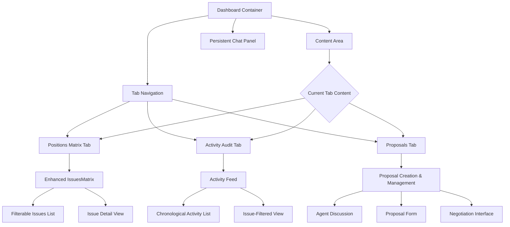
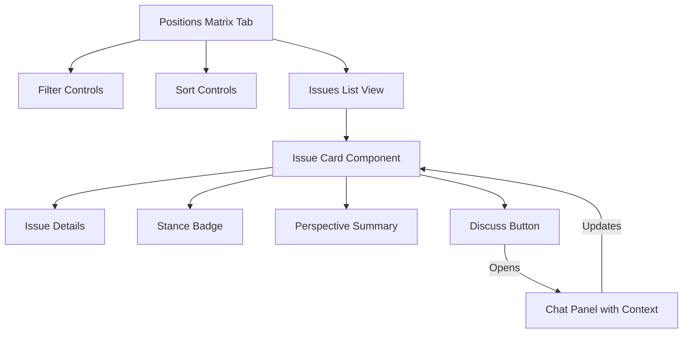
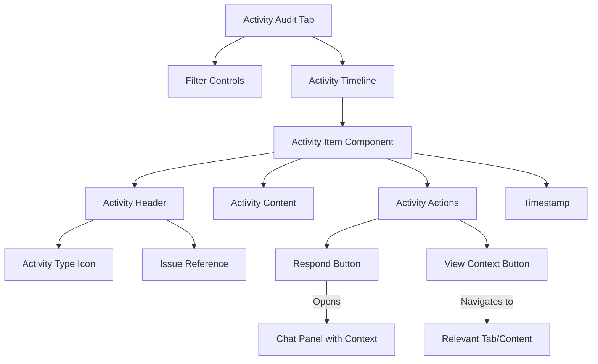
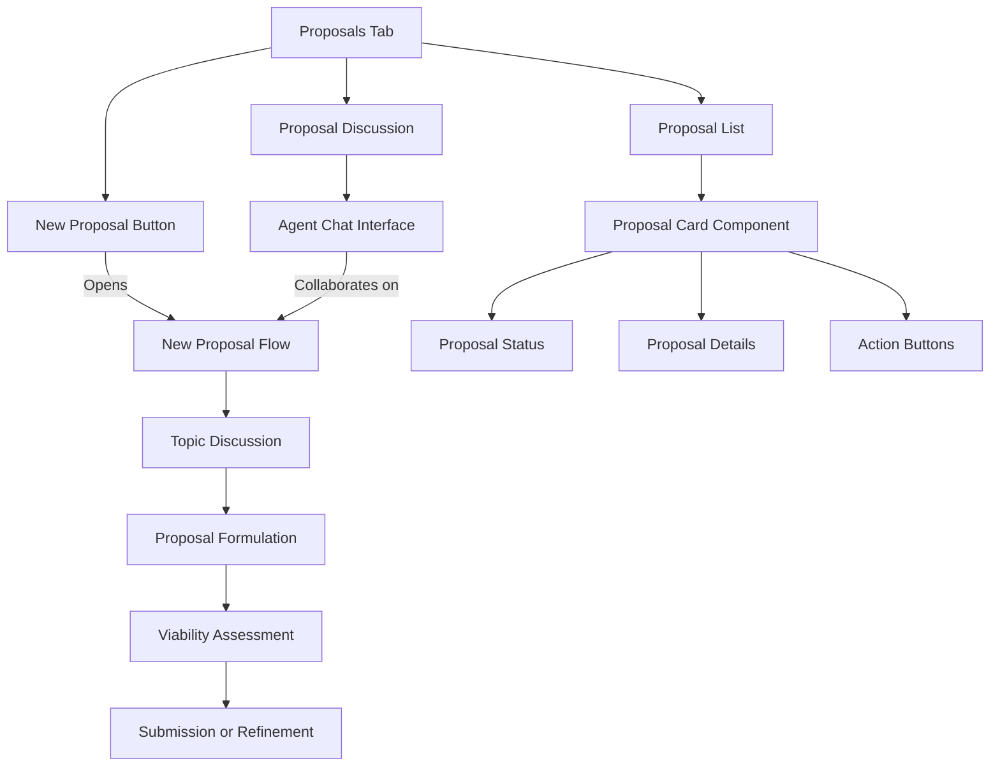
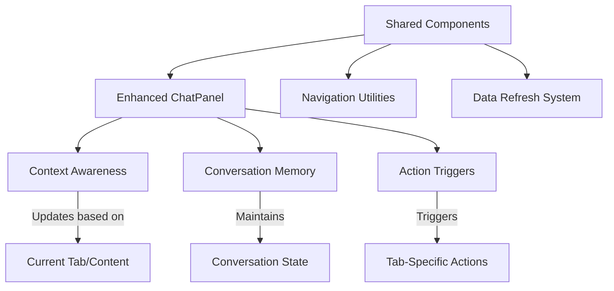
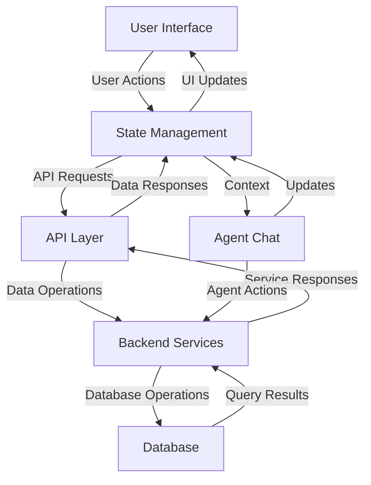

# Dashboard Redesign Completion Plan

This document outlines the detailed plan for redesigning the NDNE dashboard with three primary tabs: Positions Matrix, Activity Audit, and Proposals. The plan includes architecture, implementation phases, and interconnections between components.

## Table of Contents
1. [Overview](#overview)
2. [Dashboard Architecture](#dashboard-architecture)
3. [Tab 1: Positions Matrix](#tab-1-positions-matrix)
4. [Tab 2: Activity Audit](#tab-2-activity-audit)
5. [Tab 3: Proposals](#tab-3-proposals)
6. [Shared Components](#shared-components)
7. [Implementation Phases](#implementation-phases)
8. [Technical Considerations](#technical-considerations)

## Overview

The redesigned dashboard will feature:

- A tabbed interface with three main sections
- Persistent chat panel across all tabs for continuous agent interaction
- Intuitive navigation between related content across tabs
- Enhanced visualizations for user positions and activity
- Personalized experience addressing the user by name
- Friendly, welcoming tone with clear guidance on each tab

## Dashboard Architecture

## Tab 1: Positions Matrix

Enhancing the existing `IssuesMatrix` component to create a more interactive positions management system.

### Key Features:
1. **Default View**: Show only issues where the user has taken positions
2. **Expanded View**: Button to show ALL issues sorted by most recent update
3. **Issue Cards**: Interactive cards with issue details, stance and reasoning
4. **Discussion Trigger**: Each issue card has a button to re-open that issue for discussion with the agent
5. **Update Mechanism**: Agent can update matrix with new information during discussions

### Technical Implementation:
- Enhance `IssuesMatrix` to include filtering capabilities
- Add sorting functionality (by recency, priority, etc.)
- Implement issue discussion trigger that opens the chat panel with context
- Create a mechanism for the agent to update the matrix based on chat outcomes

### Component Structure:
1. **PositionsMatrixTab** - Main container for this tab
   - Contains personalized welcome header (e.g., "Hi [Name], here are your positions")
   - Contains filter, sort controls and issue list
   - Manages state for filtering and sorting options
   - Includes instructional guidance for new users

2. **EnhancedIssuesMatrix** - Extended version of current IssuesMatrix
   - Accepts filter and sort parameters
   - Includes action buttons on each issue
   - Shows filtered and sorted issues

3. **IssueCard** - Individual issue representation
   - Shows title, description, stance, and perspective
   - Includes "Discuss with Agent" button
   - Visual indication of recently updated issues

### UI Elements:
- **Personalized Header**: "Hi [Name], here's where your positions on important issues live"
- **Quick Guidance**: Brief explanation of what the matrix shows and how to use it
- **Empty State**: Friendly message when no positions exist yet with guidance on how to start

### Data Flow:
- Load user profile data and all issues data when tab is mounted
- Apply filters (default: only issues with positions)
- Track last update timestamp for sorting
- When "Discuss" is clicked, populate chat context and switch focus to chat
- When agent updates an issue via chat, refresh the matrix data

### API Endpoints Needed:
- `GET /api/issues` - Fetch all issues with positions
- `GET /api/issues/all` - Fetch all available issues
- `POST /api/issues/:id/discuss` - Prepare chat context for discussing an issue
- `PUT /api/issues/:id` - Update issue information

## Tab 2: Activity Audit

A chronological feed of all agent activity with filtering capabilities.

### Key Features:
1. **Chronological Feed**: Display all activity, most recent at top
2. **Activity Types**: Show various activity types (comments, votes, position updates, negotiations)
3. **Issue Filtering**: Filter to show only activities related to a specific issue
4. **Activity Details**: Expandable entries to show full context and content
5. **Action Buttons**: Options to respond to or follow up on specific activities

### Technical Implementation:
- Create new `ActivityFeed` component with virtual scrolling for performance
- Implement filtering system by activity type and issue
- Design expandable activity cards with contextual actions
- Create API endpoint to fetch filtered activity history

### Component Structure:
1. **ActivityAuditTab** - Main container for activity audit
   - Includes personalized header (e.g., "Hi [Name], here's a record of your recent activity")
   - Contains filter controls and activity feed
   - Manages state for filter options
   - Features instructional guidance for understanding the activity log

2. **ActivityFeed** - Virtualized list of activities
   - Uses `react-window` for efficient rendering
   - Handles loading more items when scrolling
   - Groups activities by date

3. **ActivityItem** - Individual activity representation
   - Different layout based on activity type
   - Expandable/collapsible details
   - Action buttons relevant to activity type

4. **ActivityFilter** - Filter controls
   - By activity type (comments, votes, positions, etc.)
   - By issue
   - By date range

### UI Elements:
- **Personalized Header**: "Hi [Name], here's what you and your agent have been up to"
- **Quick Guidance**: Brief explanation of how to read and use the activity feed
- **Empty State**: Friendly message when no activity exists yet

### Data Flow:
- Load user profile data and recent activities when tab is mounted (paginated)
- Apply filters as selected
- Load more activities when scrolling
- When "Respond" is clicked, populate chat context
- When "View Context" is clicked, navigate to relevant tab/content

### API Endpoints Needed:
- `GET /api/activity` - Fetch paginated activity feed
- `GET /api/activity/filter` - Fetch filtered activity
- `POST /api/activity/:id/respond` - Prepare chat context for responding to activity
- `GET /api/activity/:id/context` - Get contextual information for an activity

## Tab 3: Proposals

A collaborative space for discussing, creating, and managing proposals.

### Key Features:
1. **Collaborative Creation**: Dialog with agent to formulate proposals
2. **Proposal Builder**: Agent helps craft proposal with proper structure
3. **Viability Assessment**: Agent provides feedback on proposal viability
4. **Negotiation Integration**: Connect to negotiation system for formal proposals
5. **Proposal History**: View and manage existing proposals

### Technical Implementation:
- Enhance existing `NewProposalForm` with agent collaboration features
- Integrate with `ChatInterface` for proposal discussions
- Connect with negotiation components for proposal submission
- Create visualization for proposal status and feedback

### Component Structure:
1. **ProposalsTab** - Main container for proposals
   - Contains proposal list and new proposal button
   - Manages state for current view (list, create, detail)

2. **ProposalList** - List of existing proposals
   - Filterable by status, type, etc.
   - Sortable by date, status, etc.
   - Each item links to proposal detail view

3. **EnhancedProposalForm** - Collaborative proposal creation
   - Integrated with agent chat
   - Step-by-step wizard with agent assistance
   - Real-time validation and suggestions

4. **ProposalDetail** - Individual proposal view
   - Shows full proposal information
   - Displays agent feedback/viability assessment
   - Provides actions (edit, submit to negotiation, withdraw)

### UI Elements:
- **Personalized Header**: "Hi [Name], this is where your ideas take shape"
- **Quick Guidance**: Brief explanation of how proposals work and how to collaborate with your agent
- **Empty State**: Encouraging message when no proposals exist yet

### Data Flow:
- Load user profile data and proposals when tab is mounted
- When creating new proposal:
  1. Start dialogue with agent about proposal idea
  2. Agent helps refine and structure the proposal
  3. Form fields auto-populate based on dialogue
  4. Agent provides viability assessment
  5. Submit or continue refining
- Proposals can be linked to negotiations for wider discussion

### API Endpoints Needed:
- `GET /api/proposals` - Fetch user's proposals
- `POST /api/proposals/draft` - Save proposal draft
- `POST /api/proposals` - Submit final proposal
- `POST /api/proposals/:id/assessment` - Get agent's assessment of proposal viability
- `POST /api/proposals/:id/negotiate` - Submit proposal to negotiation system

## Shared Components

Several components and services will be shared across all tabs to ensure consistent functionality and user experience.

### 1. Enhanced ChatPanel
- Persistent across tabs
- Context-aware based on current view
- Maintains conversation history
- Provides action buttons relevant to current context
- Addresses user by name in conversation
- Uses friendly, conversational tone

### 2. Navigation Utilities
- Links between related content (e.g., from Activity to Source Issue)
- Breadcrumb trail for complex interactions
- "Back to" links for returning to previous contexts

### 3. Data Refresh System
- Real-time updates when changes occur in any tab
- WebSocket connection for immediate notifications
- Optimistic UI updates with fallback

## Implementation Phases

### Phase 1: Core Dashboard Infrastructure (2 weeks)
1. **Week 1: Dashboard Framework**
   - Create tabbed navigation component
   - Setup routing between tabs
   - Implement persistent layout with chat panel
   - Create shared state management

2. **Week 2: Agent Integration and Personalization**
   - Enhance chat panel for context awareness
   - Setup cross-tab communication system
   - Create action trigger framework
   - Implement basic real-time updates
   - Integrate user profile data (name, preferences)
   - Implement personalized welcomes and guidance

### Phase 2: Positions Matrix Tab (3 weeks)
1. **Week 1: Base Enhancement**
   - Extend IssuesMatrix with filtering capabilities
   - Add sorting functionality
   - Create expanded/collapsed views

2. **Week 2: Issue Interaction**
   - Implement issue discussion triggers
   - Create issue detail view
   - Setup issue update mechanism

3. **Week 3: Matrix Updates**
   - Connect agent chat to update matrix
   - Implement real-time matrix updates
   - Add animation for new/updated issues
   - Create personalized guidance and help text

### Phase 3: Activity Audit Tab (3 weeks)
1. **Week 1: Feed Structure**
   - Create ActivityFeed component
   - Implement virtual scrolling
   - Design activity item layouts

2. **Week 2: Filtering & Interaction**
   - Build filter controls
   - Implement expand/collapse functionality
   - Create action buttons

3. **Week 3: Cross-Tab Navigation**
   - Implement context links to other tabs
   - Create deep linking functionality
   - Add real-time feed updates
   - Refine personalized guidance and tooltips

### Phase 4: Proposals Tab (3 weeks)
1. **Week 1: Proposal List & Detail**
   - Create proposal list view
   - Implement proposal detail view
   - Design proposal status visualization

2. **Week 2: Collaborative Creation**
   - Enhance proposal form with agent integration
   - Implement step-by-step creation flow
   - Create viability assessment visualizations

3. **Week 3: Negotiation Integration**
   - Connect to negotiation system
   - Implement proposal submission flow
   - Create feedback/revision system
   - Personalize feedback and suggestions

### Phase 5: Integration & Refinement (2 weeks)
1. **Week 1: Cross-Tab Integration**
   - Finalize cross-tab navigation
   - Refine shared components
   - Optimize data loading and caching
   - Ensure consistent tone and personalization across all tabs

2. **Week 2: Testing & Optimization**
   - User testing and feedback
   - Performance optimization
   - Documentation and handoff
   - Test personalization with different user profiles

## Data Flow Architecture

## Technical Considerations

### 1. State Management
- Use React Context API for global state (current tab, user info, etc.)
- Use Redux for complex state management (issues matrix, activity feed)
- Use component state for UI-specific controls

### 2. Performance Optimization
- Implement virtualized lists for long content (activities, issues)
- Use lazy loading for tab content
- Implement proper memoization for expensive computations
- Optimize re-renders with React.memo and useMemo

### 3. Real-time Updates
- Implement WebSocket connection for immediate notifications
- Use optimistic UI updates with fallback
- Implement efficient delta updates

### 4. Accessibility
- Ensure proper keyboard navigation between tabs
- Use semantic HTML with appropriate ARIA roles
- Implement focus management for modal dialogs and dynamic content
- Provide text alternatives for all visual information

### 5. Mobile Responsiveness
- Design for desktop-first but ensure tablet compatibility
- Use responsive design patterns for layout
- Consider touch interactions for mobile devices
- Implement adaptive chat panel for smaller screens

### 5. Mobile Responsiveness
- Design for desktop-first but ensure tablet compatibility
- Use responsive design patterns for layout
- Consider touch interactions for mobile devices
- Implement adaptive chat panel for smaller screens
- Maintain personalized elements even in constrained layouts

### 6. Personalization
- Retrieve and use the user's name from onboarding throughout the interface
- Maintain consistent, friendly tone across all components
- Provide personalized guidance based on user experience level
- Use the agent's personality to enhance the personalized experience
- Store and respect user preferences for personalization intensity

### 7. Error Handling
- Implement global error boundary
- Provide user-friendly error messages
- Create retry mechanisms for failed operations
- Log errors for debugging

### 8. Testing Strategy
- Unit tests for individual components
- Integration tests for tab functionality
- End-to-end tests for critical paths
- Accessibility testing with automated tools

This comprehensive plan provides a roadmap for implementing the three-tab dashboard with interconnections between components. By following the implementation phases, we can deliver a cohesive, intuitive user experience that allows users to effectively manage their positions, review activity, and collaborate on proposals with their agent.

The personalized elements will make the dashboard feel welcoming and tailored to each user, addressing them by name and providing clear guidance throughout their journey. This personal touch will enhance user engagement and make the complex functionality more approachable and friendly.